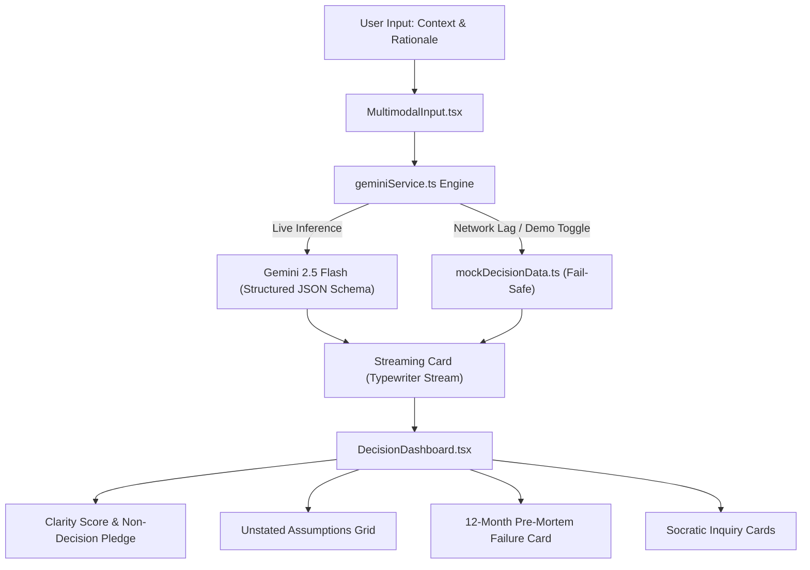

# 🧭 ReasonLens: AI-Powered Socratic Thinking Companion

[](https://aistudio.google.com/)
[](https://antigravity.google/)
[](https://react.dev/)
[](https://tailwindcss.com/)
[](https://hack2skill.com/)

> **"ReasonLens never decides for you. We stress-test your logic so you decide with conviction."**

ReasonLens is a high-stakes decision interrogation engine. Instead of generating robotic advice or making decisions on behalf of users, ReasonLens acts as an impartial Socratic companion: unmasking fragile unstated assumptions, simulating a 12-month post-decision pre-mortem failure, and asking piercing questions to shatter confirmation bias.

---

## ⚡ Core Features

1. **Dual Interrogation Canvas:** Captures both *Decision Context* (what you plan to do) and *Proposed Rationale* (why you believe it's sound). Supports multimodal doc/image attachments.
2. **Unstated Assumptions Grid:** Detects hidden premises and flags fragility with vulnerability badges (`🔴 HIGH`, `🟡 MED`, `🟢 LOW`).
3. **12-Month Pre-Mortem Simulator:** Simulates prospective failure modes and isolates the root catalyst before irreversible resources are committed.
4. **Piercing Socratic Inquiries:** Formulates 3 targeted questions tied to strategic cognitive angles (liquidity stress-testing, opportunity cost, push vs. pull motivation).
5. **Dual-Mode High Availability:** Features live streaming powered by **Gemini 2.5 Flash** with deterministic JSON schemas, plus an instant zero-latency **Demo Mode** fallback.

---

## 🏛️ Architecture & Clean Design



### Architectural Principles Enforced:
- **Package-by-Feature Scaffolding:** Presentation is decoupled from inference logic.
- **Strict File-Size Caps:** All components and service modules are maintained strictly under 150 lines.
- **Vibe Layer:** Frosted glassmorphism (`backdrop-blur-xl`), tactile button compression (`active:scale-[0.98]`), and ambient gradient backdrops.

---

## 🚀 Quickstart & Local Setup

### Prerequisites
- Node.js 18+ and npm installed
- *(Optional)* Gemini API Key from [Google AI Studio](https://aistudio.google.com/)

### 1. Clone & Install
```bash
cd ~/WORK/promptwars/solution
npm install
```

### 2. Configure Environment (Optional)
```bash
cp .env.example .env
# Set your VITE_GEMINI_API_KEY=AIzaSy...
```
*(Note: If no API key is provided, ReasonLens automatically engages the offline Demo Mode with rich, interactive mock scenarios).*

### 3. Start Development Server
```bash
npm run dev
```
Open [http://localhost:5173](http://localhost:5173) in your browser.

### 4. Build for Production
```bash
npm run build
```
Generates optimized static assets in `dist/` ready for 1-click deployment on Netlify Drop or Vercel.

---

## 👥 Hackathon Credits
- **Event:** PromptWars 2026
- **Venue:** St. Vincent Pallotti College of Engineering and Technology (SVPCET), Nagpur
- **Organizers:** Engineering India x Hack2Skill x Google for Developers
