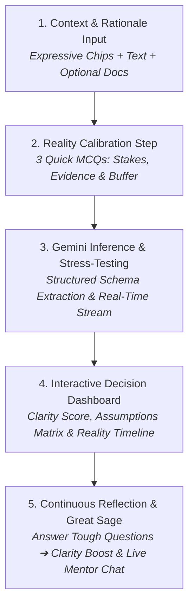

# 🧭 ReasonLens: AI Thinking Partner for High-Stakes Decisions

[](https://labs.google/)
[](https://aistudio.google.com/)
[](https://antigravity.google/)
[](https://hack2skill.com/)
[](https://opensource.org/licenses/MIT)

> **"ReasonLens never decides for you. We stress-test your logic so you decide with conviction."**

ReasonLens is an experimental **AI Thinking Partner** built in the spirit of Google Labs. Rather than generating robotic answers or making decisions on behalf of users, ReasonLens acts as an intellectual mirror: unmasking fragile unstated assumptions, simulating a 12-month reality check, and asking tough questions that force you to **use your own brain**.

---

## 🚩 The Problem: Why Most Decisions Fail (and Why AI Makes It Worse)

When humans make high-stakes choices—quitting a job for a startup, rewriting an entire codebase, pivoting a business model, or skipping campus placements for open-source—we suffer from two fatal cognitive traps:
1. **Confirmation Bias & Availability Heuristic:** We fall in love with our plan and fixate on what supports it, ignoring the silent, fragile premises underneath.
2. **AI "Yes-Men" & Robbed Agency:** Most modern AI tools make this worse in one of two ways:
   - **They act as sycophants:** Validating whatever idea you type because language models are trained to be agreeable.
   - **Or they usurp human agency:** Answering *"Based on your input, you should choose Option B"*. This strips away human responsibility, leaving the user vulnerable and unprepared when reality hits.

---

## 💡 The Solution: ReasonLens

ReasonLens flips the paradigm. It is designed around a strict invariant: **The AI is forbidden from telling you what to do.**

Instead of acting as a GPS that tells you which turn to take, ReasonLens acts as a **stress-testing laboratory**:
- It pulls apart your **Decision Context** from your **Proposed Rationale**.
- It extracts the **hidden premises you took for granted** without realizing it.
- It calculates an objective **Clarity Score** based on real-world constraints.
- It simulates a **12-Month Reality Check Timeline** to show where things could stall.
- It connects you with the **Great Sage**, a calm, wise mentor that questions your path so you walk into it with open eyes.

---

## 🧠 How We Force Users to Use Their Brain (Instead of Guiding Them)

| Traditional AI Assistants | ReasonLens Thinking Partner |
| :--- | :--- |
| *"You should quit your job and pursue the startup."* | *"What evidence proves customer demand, and what sustains you in month 7 if sales take a year?"* |
| Tells you what to do (passive reliance). | Asks grounding questions that demand reflection (active agency). |
| Validates your biases with pleasant generic advice. | Identifies your most fragile unstated assumption and challenges it. |
| Ignores failure modes until they happen. | Runs a prospective 12-month reality check before you commit resources. |
| Human is an onlooker. | **Human retains 100% of the decision ownership and conviction.** |

---

## 🔄 The 4-Step Interactive Thinking Loop



### 1. Unified Generative Studio Canvas
- Separates **"What are you deciding?"** from **"Why do you think it's a good idea?"**.
- Includes 4 Google Labs **Expressive Chips** for instant 1-tap testing:
  - 🚀 *Startup Leap:* Quitting full-time employment for an AI venture.
  - 🔄 *Codebase Rewrite:* Scrapping a legacy application for a new stack.
  - 💰 *Pricing Pivot:* Killing the free tier to go paid-only.
  - 🎓 *Career Bet:* Skipping campus placements for open-source contributions.

### 2. Interactive MCQ Reality Calibration
Before running the deep analysis, ReasonLens calibrates the real-world boundaries in 10 seconds:
- **Reversibility (Stakes):** *Burn the boats* vs. *6–12 months recovery* vs. *Easily reversible*.
- **Evidence Level (Proof):** *Gut instinct* vs. *Peer validation* vs. *Hard data & signed commitments*.
- **Safety Margin (Buffer):** *Zero cushion* vs. *3–6 months* vs. *12+ months safety net*.

### 3. Deep Decision Breakdown
- **Clarity Meter (0–100):** Visual animated gauge with Type 1 (irreversible) vs. Type 2 (reversible) classification.
- **Unstated Assumptions Matrix:** Identifies 3 implicit gambles rated `🔴 HIGH RISK`, `🟡 MED RISK`, or `🟢 MINOR RISK`, complete with a 1-click **⚡ 48h Stress-Test Drawer**.
- **12-Month Reality Check Timeline:** A 3-stage post-decision failure forecast isolating the root catalyst.
- **Tough Questions (Answerable Loop):** Three targeted reflection questions with interactive answer boxes that dynamically update your Clarity Score.

### 4. Great Sage: The Multi-Turn Thinking Partner
- A floating companion widget (`🔮 Great Sage • Online`) docked in the bottom-right corner.
- Powered by a streaming multi-turn Gemini dialogue.
- Acts as a serene, wise guide who respects your ambition, but asks the tough, grounding questions that friends are often afraid to ask.

---

## 🎨 Google Labs & Antigravity Aesthetics

- **Google 4-Color Ribbon:** The signature 2px Google brand gradient (`#4285F4`, `#EA4335`, `#FBBC05`, `#34A853`) across the top header.
- **Ambient Gemini Aurora:** Multi-layered blurred ambient glows (Sapphire Blue, Royal Violet, Rose) on an elevated obsidian background (`#0B0E14`).
- **Interactive Magnetic Dot Canvas:** An HTML5 canvas grid where background dots subtly gravitate toward your mouse pointer, inspired by the Google Antigravity homepage.
- **Everyday Conversational Copy:** Zero academic or robotic jargon (`PARAM: CONTEXT`, `VEC-01`, and `INTERROGATE DECISION` have been replaced with clear, conversational English).
- **1-Click Decision Memo:** Export your complete decision analysis as formatted Markdown or print directly to PDF.

---

## 🛡️ Technical Architecture & Reliability

- **Frontend:** React 18, TypeScript, Tailwind CSS 3.4, Lucide Icons, Vite.
- **AI Engine:** Google Gemini API (`@google/generative-ai` & `@google/genai`) with strict JSON schema enforcement (`responseMimeType: "application/json"`).
- **Zero-Downtime Dual-Mode Resilience:**
  - `🟢 LIVE INFERENCE`: Direct streaming from Google Gemini.
  - `🟡 DEMO MODE`: Client-side fail-safe simulation ensuring live hackathon presentations and offline evaluations never crash if Wi-Fi or API limits hit.
- **Clean Architecture:** Fully decoupled components, custom streaming hooks, and zero monolithic files.

---

## 🚀 Getting Started

### Prerequisites
- Node.js 18+ and npm installed
- *(Optional)* A Gemini API Key from [Google AI Studio](https://aistudio.google.com/)

### 1. Installation
```bash
git clone https://github.com/crunchyrolll1810-cyber/Adityashambharkar_Promptwars.git
cd Adityashambharkar_Promptwars
npm install
```

### 2. Environment Setup (Optional for Live API)
Create a `.env` file in the root directory:
```bash
VITE_GEMINI_API_KEY=your_gemini_api_key_here
```
*(Note: If no API key is provided, ReasonLens automatically runs in Demo Mode with rich, full-featured simulation data).*

### 3. Launch Development Server
```bash
npm run dev
```
Open [http://localhost:5173](http://localhost:5173) in your browser.

### 4. Build for Production
```bash
npm run build
```
Generates an optimized, production-ready static bundle in the `dist/` directory ready for 1-click deployment on **Vercel** or **Netlify**.

---

## 🏆 PromptWars 2026 Submission Details

- **Event:** PromptWars 2026 • SVPCET Nagpur
- **Organizers:** Engineering India x Hack2Skill x Google for Developers
- **Track:** AI Agents & Prompt Engineering
- **Author:** Aditya Shambharkar

---

## 📄 License
This project is licensed under the MIT License - see the [LICENSE](LICENSE) file for details.
